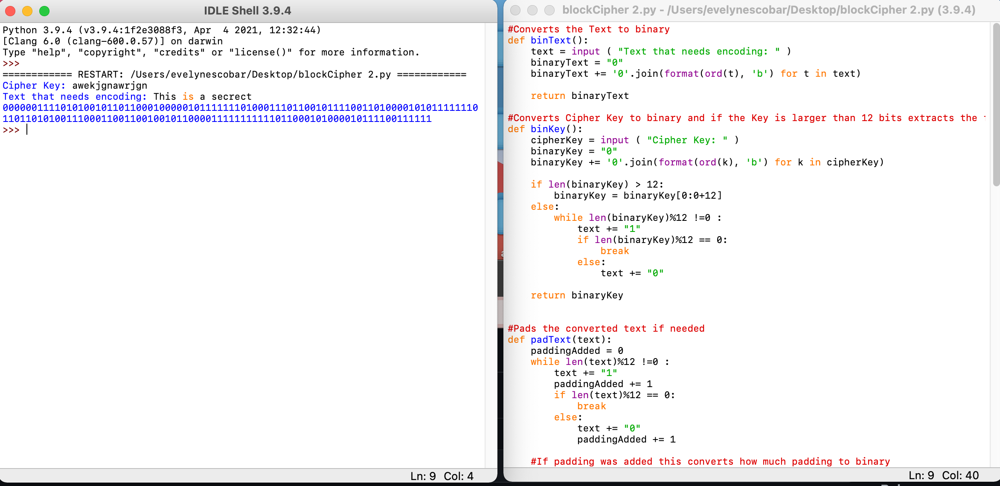

# EncryptionBlockCipher

#A block cipher method called chaining to make a much more secure ciphertext message.

#I created this block cipher encryption using Python for my IT4100 class. I converted the ascii key to a binary (10101010) representation. I then convert the ascii text to binary representation. I then break the binary text from number 2 up into some larger blocks. Finally, I added some padding, then appended a final block (of size 12) that contains the number of bits I added. I then took the first block to be encrypted, reverse it, Xor it with the first 12 bits of the key. Then, took next block and Xor it with the encrypted output of the first block. Reversed the new block, xored it with the first 12 bits of the key.

